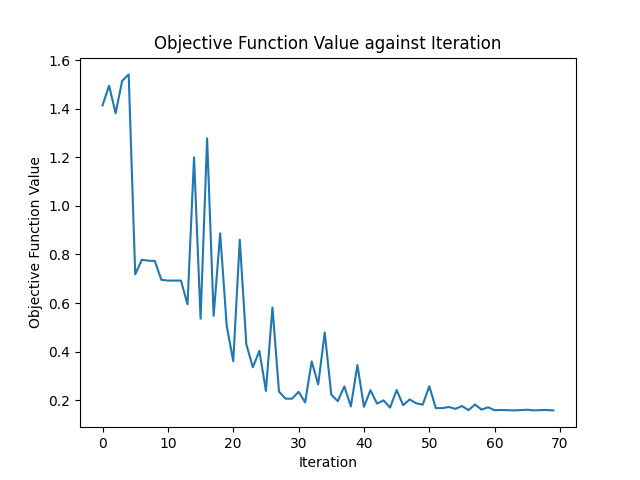

# quantum-ml
----

This is an experiment in implementing variational quantum circuits for 
MNIST Handwritten Digit classification.

----
Binary classification of 0 and 1 digits:

Loss function of VQC:

Train Error: 0.714286%

Test Error: 0.75%

Weights: 'vqc_weights.pt'

----

Multiclass VQC:

Train Error: 18.9%%

Test Error:  18.2%

Weights: 'vqc_weights_2.pt'

----

Ridge regression on whole dataset:

Train Error: 12.8571%

Test Error: 14.25%

----
This code is a part of Qiskit

© Copyright IBM 2017, 2022.

This code is licensed under the Apache License, Version 2.0. You may
obtain a copy of this license in the LICENSE.txt file in the root directory
of this source tree or at http://www.apache.org/licenses/LICENSE-2.0.

Any modifications or derivative works of this code must retain this
copyright notice, and modified files need to carry a notice indicating
that they have been altered from the originals.